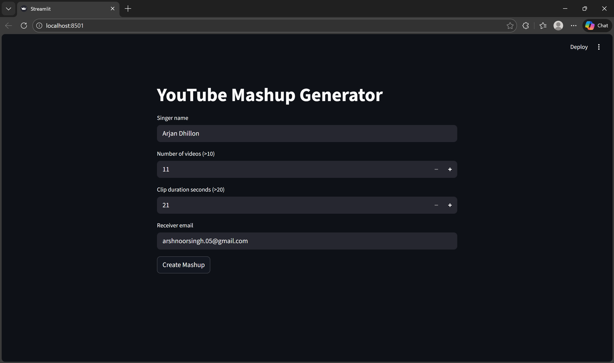
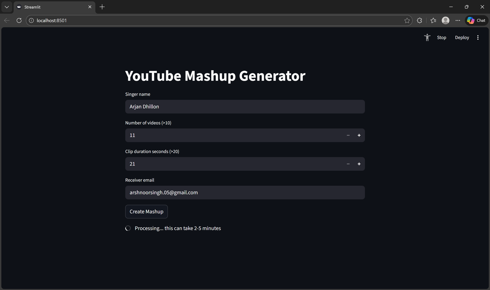
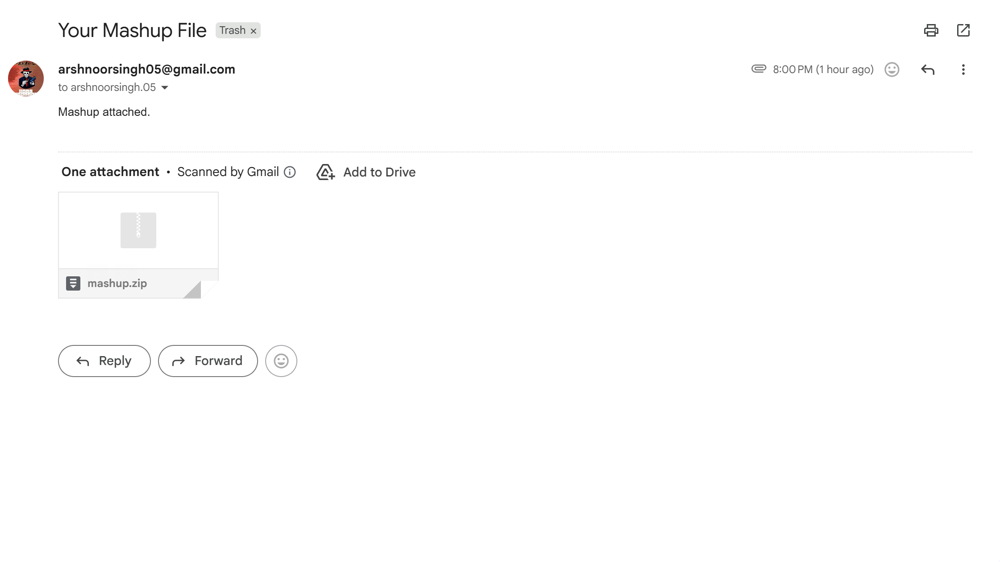

# Mashup Generator

This project generates an audio mashup from YouTube videos in two forms:

* Command line tool
* Web application using Streamlit

The system searches for YouTube videos of a given singer, downloads audio, trims each clip to a fixed duration, and merges them into one final mashup file.

---

## Part 1: Command Line Tool

The mashup can be generated directly from the terminal using a Python script.

### Input Parameters

The program requires the following inputs:

* Singer name
* Number of videos
* Duration (in seconds)
* Output file name
* Receiver email

### Command Line Usage

```markdown
python Part 1/102317161.py "Singer Name" <number_of_videos> <duration_in_seconds> <output_file> <receiver_email>
```

### Example

```markdown
python Part 1/102317161.py "Arijit Singh" 12 30 mashup.mp3 example@gmail.com
```

### Output

The program generates:

* Downloaded audio clips
* Trimmed audio files
* Final merged mashup file
* ZIP file containing the mashup

The final output is saved in the project directory.

---

## Part 2: Web Application (Streamlit)

A web interface is implemented using Streamlit. Users can:

* Enter singer name
* Enter number of videos
* Enter duration
* Enter receiver email
* Generate mashup
* Download the final mashup file

### Run the Web App

```markdown
streamlit run Part 2/app.py
```

Then open in a browser:

```markdown
http://localhost:8501
```

---

## Project Structure

```markdown
Mashup_Assignment/
│
├── Part 1/
│   └── 102317161.py
│
├── Part 2/
|   └── 102317161.py
│   └── app.py
│
├── requirements.txt
└── README.md
```

---

## Screenshots

### Web Application Interface


### Mashup Generation Process


### Mail result


---

## Requirements

* Python 3.x
* streamlit
* pytubefix
* moviepy
* imageio-ffmpeg

Install dependencies:

```markdown
pip install -r requirements.txt
```

---

## Notes

* Internet connection is required for downloading audio.
* FFmpeg must be installed and added to system PATH.
* Number of videos and duration must be valid positive integers.
* The project is intended for academic and demonstration purposes.

---

## Author

**Arshnoor Singh**

---
